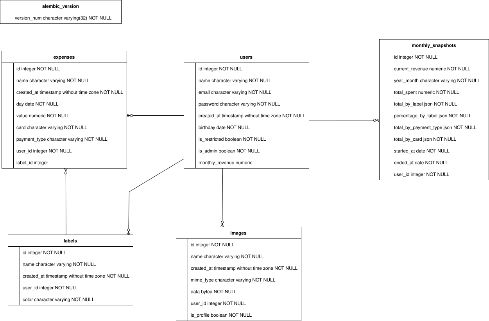

# Expenses Control

Expenses Control is a full-stack web application designed for personal finance management. It allows users to track their expenses, categorize them with labels, and view monthly financial summaries and historical spending data.

### Containerization

- **Docker & Docker Compose**: The entire application stack (frontend, backend, and database) is **containerized** for easy setup and consistent deployment.

## Getting Started

To run this project locally, you will need Docker and Docker Compose installed on your machine.

1. **Clone the repository:**

   ```bash
   git clone https://github.com/marianav11/expenses_control.git
   cd expenses_control
   ```

2. **Build and run the application:**
   Use Docker Compose to build the images and start the containers for the frontend, backend, and database services.

   ```bash
   docker-compose up --build
   ```

3. **Access the application:**
   - **Frontend**: Open your browser and navigate to `http://localhost:3000`
   - **Backend API Docs**: The FastAPI documentation is available at `http://localhost:8000/api/docs`

## Features

- **User Authentication**: Secure user registration and login system using **JWT**.
- **Expense Management**: Full **CRUD** (Create, Read, Update, Delete) functionality for expenses.
- **Dynamic Filtering & Sorting**: Filter expenses by date range, label, payment method, and card. Sort data by various fields.
- **Custom Labels**: Create, update, and delete custom labels with unique colors to categorize expenses.
- **Financial Dashboard**: View a real-time **summary of monthly revenue, total expenses, and remaining balance**.
- **Profile Customization**: Users can update their personal information, change their password, and upload a profile picture.
- **Spending History**: Access detailed monthly snapshots of past financial activity, including spending breakdowns by category, payment type, and card.
- **Appearance Settings**: Toggle between light and dark themes for a personalized user experience.

---

### Backend

- **Framework**: **FastAPI** (Python) for a high-performance RESTful API.
- **Database**: **PostgreSQL** for robust and reliable data storage.
- **ORM**: **SQLAlchemy** for interacting with the database.
- **Migrations**: **Alembic** for managing database schema changes.
- **Authentication**: **JWT** for secure, token-based authentication.

#### Other Technologies

- **pre-commit**: Used to automatically run Ruff formatting on all backend files whenever a `git commit` is executed. This ensures that the code remains consistently formatted and clean.

### Architecture

The project architecture is organized into directories that separate the responsibilities of the application, improving code organization, maintainability, and scalability.

The project follows a **\*\***Layered Architecture**\*\*** (also known as **\*\***N-Tier Architecture**\*\***), more specifically the **\*\***Controller-Service pattern**\*\***, where each layer has a single, well-defined responsibility. This promotes separation of concerns, making the codebase easier to test, maintain, and scale.

**- alembic/**
Responsible for database migrations, allowing the database schema to be versioned and updated in a controlled way over time.

**- controller/**
Contains the API controllers, which handle incoming HTTP requests, call the appropriate services, and return responses to the client.

**- models/**
Defines the data models of the application, representing the database tables and their relationships.

**- schemas/**
Contains the data validation and serialization schemas, used to validate request data and structure the API responses.

**- services/**
Responsible for the business logic of the application, implementing rules, validations, and operations before interacting with the database.

**- utils/**
Stores utility and helper functions, such as authentication, security utilities, and other reusable functionalities.

In addition to the directories, the project includes files responsible for application infrastructure:

- **main.py:** the main entry point of the application, where the API is initialized.
- **database.py**: configures the database connection.
- **config.py:** centralizes application configuration settings.
- **factory.py:** responsible for creating and configuring the application instance.
- **Dockerfile**: defines the container environment used to run the application.
- **pyproject.toml / uv.lock:** manage the project dependencies.

---

### Frontend

- **Framework**: **Next.js** (React) for a fast, server-rendered user interface.
- **Language**: **TypeScript** for type safety and improved developer experience.
- **Styling**: **Tailwind CSS** and **shadcn/ui** for a modern and responsive design system.
- **State Management**: **Zustand** for lightweight and simple global state management.

Aqui está a versão **corrigida e mais natural em inglês**, mantendo seu conteúdo:

#### Other Technologies

- **react-hook-form** and **zod**: Used for form handling and validation across the application.
- **react-toastify**: Used to provide feedback to users about their actions and request results throughout the application.
- **recharts**: A charting library used to create interactive charts in the application.
- **styled-components**: Used for styling some components inspired by designs from [https://uiverse.io](https://uiverse.io). The login button was adapted from there and uses this library.
- **axios**: Used to build the service layer and handle HTTP requests between the frontend and the backend.

### Architecture

The frontend architecture is organized into directories that separate the responsibilities of the interface.

**- app/**
Contains the main **application routing and pages**, following the Next.js App Router structure. Each folder represents a route or section of the application, such as expenses, history, or settings. It also includes global styles and layout configuration.

**- components/**
Stores **reusable UI components** used across different parts of the application. This includes shared interface elements and grouped components such as external integrations or UI elements.

**- feature/**
Organizes the application by **business features**, grouping components, logic, and functionality related to specific modules such as authentication, expenses, financial summaries, settings, and spending history.

**- layout/**
Contains **layout components** responsible for defining the structural organization of pages, such as default layouts used across multiple screens.

**- lib/**
Includes **general helper utilities** that support the application logic but are not directly related to UI or business features.

**- public/**
Stores **static assets** such as images, icons, and illustrations that can be accessed directly by the frontend.

**- service/**
Responsible for **communication with external services and APIs**, including HTTP configuration, local storage management, and notification handling.

**- store/**
Contains the **global state management logic** of the application, storing shared data such as user information, labels, banks, and UI states.

**- types/**
Defines **TypeScript type definitions and interfaces** used across the application to ensure type safety and consistency in data structures.

**- utils/**
Provides **utility functions** used throughout the application, such as currency formatting and date manipulation.

In addition to these directories, several configuration and infrastructure files support the frontend:

- **Dockerfile**: defines the container environment for running the frontend application.
- **next.config.ts**: configuration file for the Next.js framework.
- **package.json / package-lock.json**: manage project dependencies and scripts.
- **tsconfig.json**: TypeScript configuration for the project.
- **postcss.config.mjs**: configuration for CSS processing tools such as PostCSS.
- **eslint.config.mjs**: defines linting rules to maintain code quality.
- **components.json**: configuration file related to component management or UI libraries.
- **next-env.d.ts**: TypeScript environment definitions used by Next.js.

---

### Database

The application uses **PostgreSQL** as its database. An **Entity-Relationship Model (ERM)** was designed to represent the structure of the database and the relationships between its tables.



---

## License

This project is licensed under the MIT License. See the [LICENSE](./LICENSE) file for details.
